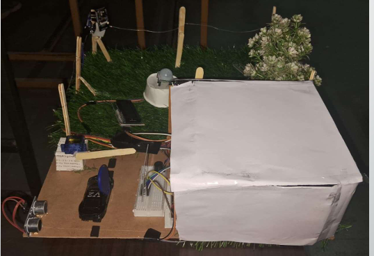
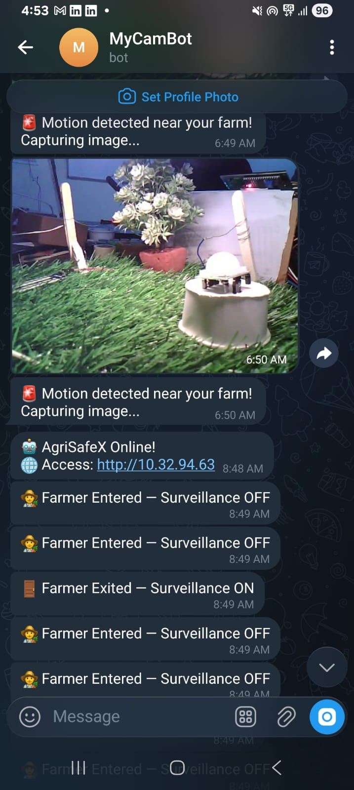

# 🚜 FarmGuardX

Smart Farm Safety & Access Control System

FarmGuardX is an IoT-based farm security solution designed to provide intelligent monitoring, intrusion detection, and secure access control for agricultural environments.

The system integrates ESP32-CAM surveillance, RFID authentication, motion detection, ultrasonic sensing, automated gate control, and Telegram notifications to protect farms from unauthorized access.

---

## 📌 Features

- RFID-Based Authorized Access
- ESP32-CAM Surveillance
- Intrusion Detection
- Telegram Alert Notifications
- Automated Gate Control
- Real-Time Monitoring
- Buzzer Alarm System
- Visitor Detection

---

## 🛠 Hardware Components

| Component | Purpose |
|------------|------------|
| Arduino Nano | Main Controller |
| ESP32-CAM | Image Capture & Communication |
| RC522 RFID Reader | Authentication |
| PIR Sensor | Motion Detection |
| Ultrasonic Sensor | Distance Detection |
| Servo Motor | Gate Control |
| Relay Module | Device Switching |
| Buzzer | Security Alarm |

---

## 🏗 System Architecture

RFID Authentication
↓
Access Verification
↓
Authorized ?
├── Yes → Open Gate
└── No
↓
Motion Detection
↓
Capture Image
↓
Telegram Alert
↓
Sound Alarm

---

## 📷 Prototype Images

### Complete Prototype



### Working Setup


---

## 📸 Screenshots

### Telegram Alert



### RFID Authentication


### Intrusion Detection


---

## ⚙️ Code Structure

```
Arduino_Nano_Code/
└── FarmGuardX_Nano.ino

ESP32_CAM_Code/
└── FarmGuardX_ESP32CAM.ino
```

### Arduino Nano

Responsible for:

- RFID Authentication
- PIR Monitoring
- Ultrasonic Detection
- Servo Control
- Alarm Activation

### ESP32-CAM

Responsible for:

- Capturing Images
- Sending Telegram Notifications
- Remote Monitoring

---

## 🚀 Future Improvements

- AI Face Recognition
- Mobile Application
- Cloud Dashboard
- Animal Detection
- Solar Powered Deployment

---

## 👨‍💻 Developer

**Prathik V T**

Electronics & Communication Engineering

JNNCE, Shivamogga

---

## 📄 License

This project is developed for educational, research, and agricultural security applications.
